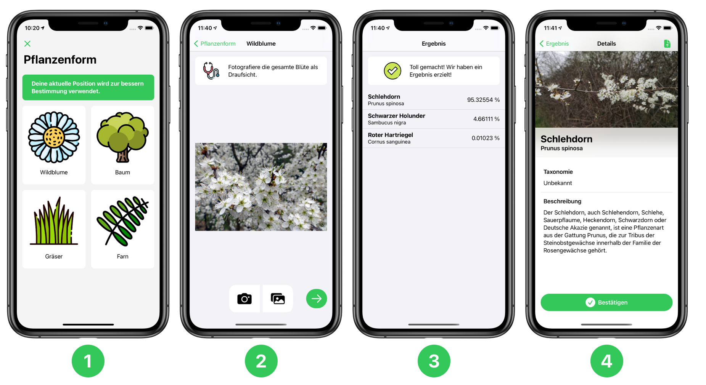

<h1 align="center">Planti-iOS</h1>

## Über Planti-iOS
Die mobile Anwendung *Planti* ist eine Anwendung für die Klassifikation von Pflanzen. Zielgruppe dieser Anwendung sind interessierte Menschen aller Altersklassen und insbesondere Schüler. In der Anwendung wird die Schnittstelle der [Planti API](http://64.227.119.182:5000/api/) genutzt.

## Klassifikation

Die Klassifikation der *Planti App* gliedert sich in 4 Stufen. In der ersten wählt der Nutzer / die Nutzerin die Pflanzenform der Zielpflanze aus. Es folgt in Stufe 2 der Bestimmungsprozess mit Daten-Upload. Anschließen werden die drei besten Ergebnisse aus der Referenzdatenbank vorgestellt. Zuletzt hat der Nutzer / die Nutzerin die Möglichkeit die Auswahl zu bestätigen. 
